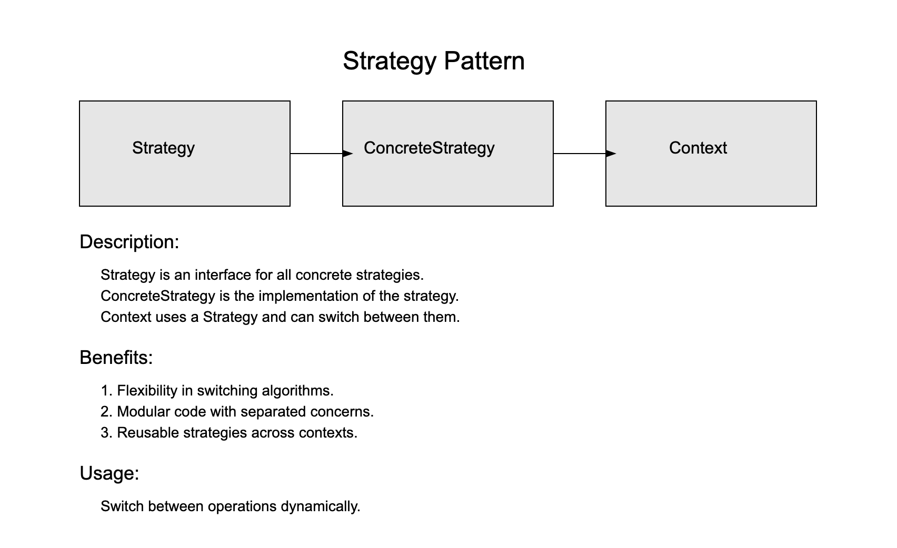

### Definition:

The Strategy Pattern defines a family of algorithms, encapsulates each one, and makes them interchangeable. 
It lets the algorithm vary independently from clients that use it.

In this case, our algorithms are search strategies for solidity smart contract security issues.

### Description:

In the Strategy Pattern, you have:

1. **Strategy**: This is an interface that is used by all concrete strategies. It defines a method that all concrete strategies must implement.

2. **ConcreteStrategy**: These are the individual strategies that implement the Strategy interface. Each one encapsulates a specific algorithm or behavior.

3. **Context**: This is a class that uses a Strategy. It can switch between different strategies based on its needs. The Context receives a strategy object upon its instantiation or through a setter method, and it executes the strategy it has.

#### In this case:

- **Strategy**: Each of the checking functions like `check_outdated_versions`, `check_pragma_experimental`, etc.
- **ConcreteStrategy**: The actual implementations of each checking function.
- **Context**: The `analyze_solidity_file` function which takes in a list of strategies (`check_structures`) and applies them to the Solidity file.

### Benefits:

1. **Flexibility**: You can easily switch, add, or remove algorithms without changing the code that uses them.
2. **Separation of Concerns
   **: Each strategy encapsulates a specific behavior, making the code more modular and easier to understand.
3. **Reusability**: Strategies can be reused across different contexts.

### Usage:

The Strategy Pattern is particularly useful when you have multiple ways to perform an operation and you want to switch between them dynamically. In the case of the provided code, the different ways to analyze the Solidity code are encapsulated as separate strategies, allowing for easy addition, removal, or modification of individual checks.
